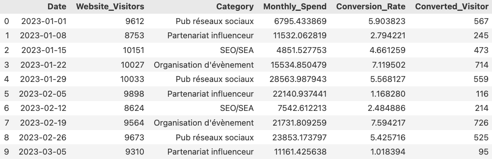

# esd-2024

Google collab: https://colab.research.google.com/drive/1oFMkUPCesMIVNmcwa8iRfWrZzWQBoF_l?usp=sharing

mail: joseph.barbierdarnal@gmail.com

  

# Projet

### Contexte

L'entreprise SellBetter avait un client en 2023 et a réalisé différentes stratégies pour augmenter les ventes de son produit ABC. Les achats du produit ABC ne peuvent se faire que via le site du client à un prix unique de 80€.

Toutes les semaines, a été investi une certaine somme d'argent dans une de ces catégories :

- Réseaux sociaux: publicité sur instagram/tiktok/facebook
- SEO/SEA
- Partenariat influenceur
- Organisation d'événement

### But

Le client souhaite continuer à travailler avec SellBetter pour 2024, mais souhaite améliorer sa stratégie d'acquisition, notamment en faisant davantage de partenariat avec des influenceurs.

L'objectif est de faire :

- un bilan des différentes stratégies de 2023
- donner des indications/recommendations pour 2024
- créer un rapport pour le client qui explique le tout au client

  
